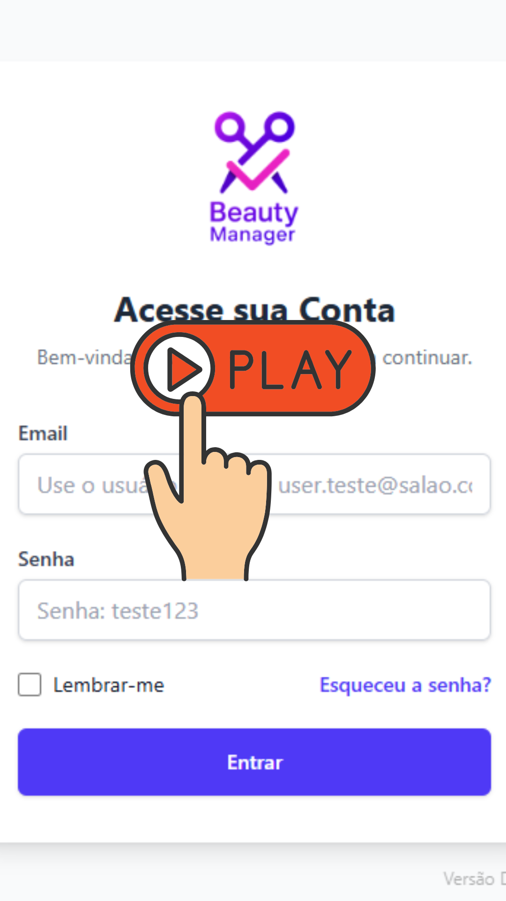

  
  <h1>Beauty Salon Demo – Otimizando a Gestão de Salões de Beleza</h1>
  
<strong>Demo pública do projeto autoral “Mar de Beleza”</strong>

  
  
  
  
  

 

## 📝 Sobre o Projeto

Esta é a **demonstração pública** do meu sistema autoral **Mar de Beleza**, desenvolvido para digitalizar e otimizar a gestão de salões de beleza.  
Em um mercado competitivo, a eficiência é chave. O Mar de Beleza surge como uma solução robusta para transformar a administração de salões, permitindo agendamentos rápidos, gestão de clientes, profissionais e serviços, além de um painel financeiro para acompanhar o apurado total e das funcionárias.

> 🔗 **[Clique aqui para acessar a Demo Pública](https://beauty-manager-demo.vercel.app/)**

---

## 🎥 Demonstração em Vídeo

*(Clique na imagem para conhecer o Sistema em um Tour Rápido)*

---

## ✨ Funcionalidades Principais

- **Agendamentos simplificados:**  
  - Criação, edição e exclusão de agendamentos **para otimizar o tempo e reduzir erros**.
  - Filtros avançados por profissional, cliente, data e status.
  - Visualização da agenda do dia ou de outros dias.

- **Confirmação de clientes por WhatsApp:**  
  - Ícone de WhatsApp para contato e enviar confirmação em um clique, **melhorando a comunicação e a taxa de comparecimento**.
- **Dashboard inteligente:**  
  - Agenda do dia filtrável por profissional.
  - Resumo dos próximos atendimentos.
  - Card de próximo agendamento (Visão da funcionária)
- **Painéis de Gestão:**
  - **Clientes:** cadastro completo e busca rápida.
  - **Profissionais:** gerenciamento de funcionárias e especialidades.
  - **Serviços:** catálogo com duração e preço.
  - **Usuários (Funcionárias):** controle de acessos.
  - **Financeiro:** gestão do apurado total por período e por funcionária, facilitando o pagamento.
- **PWA Mobile:**  
  - Pode ser instalado no celular como um app nativo.
- **Brevo API:**  
  - Integração com API para envio de email de redefinição de senha.

---

## 📸 Apresentação Visual

| Login e Dashboard (GIF) | Clientes e Profissionais (GIF) |
| :---: | :---: |
|  |  |
| *Tela inicial de autenticação e tela para agenda do dia.* | *Tela de gestão de clientes e usuárias (funcionárias).* |

| Agendamentos & Financeiro (GIF) | Modais de Interação (GIF) |
| :---: | :---: |
|  |  |
| *Tela para gestão de agendamentos e painel financeiro.* | *Modais: agendamentos, status, pagamentos, clientes e serviços.* |

---

## 🏗️ Arquitetura do Sistema

O projeto foi concebido com uma arquitetura de aplicação moderna e desacoplada, separando o **Backend** (API RESTful em Java 21 + Spring Boot 3) e o **Frontend** (React 18 + TypeScript + Vite). Essa abordagem garante **escalabilidade, manutenibilidade** e **flexibilidade** para futuras expansões ou integrações. O uso de **PostgreSQL** como banco de dados relacional e a hospedagem em plataformas como **Railway e Vercel** reforçam a robustez e a agilidade no deployment da aplicação.

---

## 🚀 Próximos Passos (Roadmap)

- [ ] Integração com relatórios financeiros avançados.
- [ ] Integração com API WhatsApp para Notificações automáticas.
- [ ] Versão mobile responsiva aprimorada (Google e iOS).

---

## 💻 Tecnologias

**Backend:** Java 21 · Spring Boot 3 · Spring Security (JWT) · Spring Data JPA  
**Frontend:** React 18 · TypeScript 5 · Vite · Tailwind CSS  
**Banco de Dados:** PostgreSQL  
**Infraestrutura:** Maven · Git/GitHub · Testes Unitários e de Integração (JUnit 5)  
**Deploy:** Railway (backend) · Vercel (frontend)

---

  
Desenvolvido por Rafael Maia

  
  

