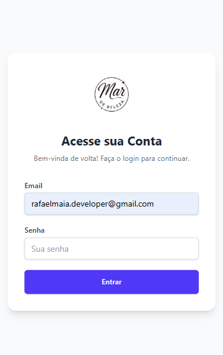
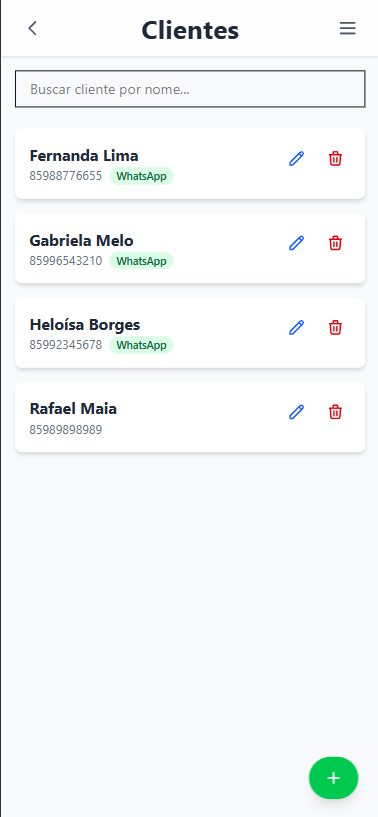
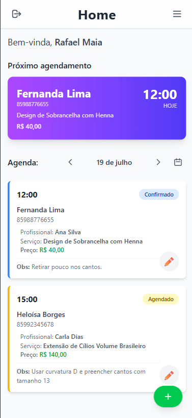
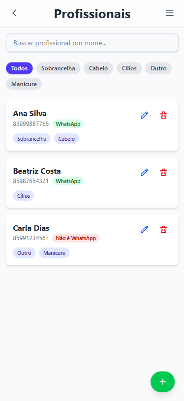
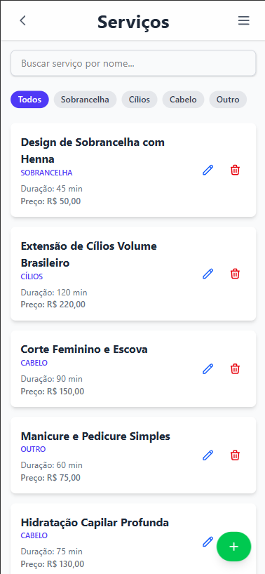
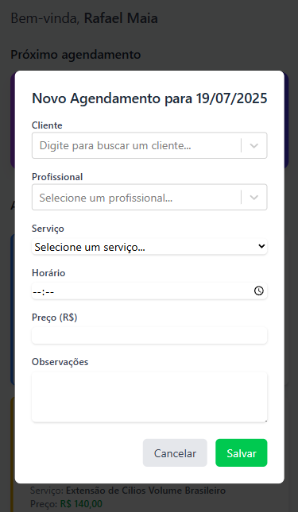
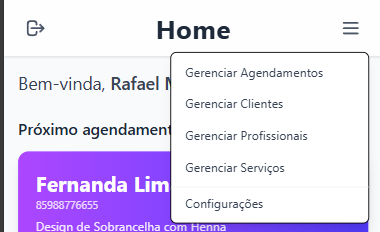
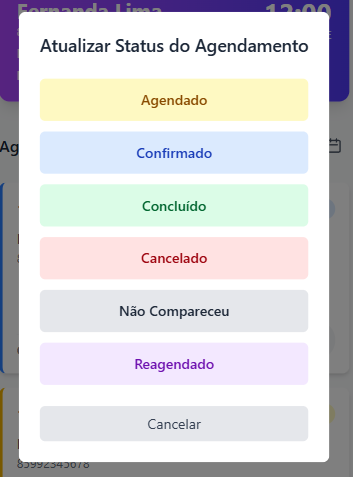

  
  <h1>Mar de Beleza - Sistema de Agendamento</h1>
  
<strong>Um projeto Full-Stack para gestão de salões de beleza.</strong>

  
  
  
  
  

 

Este é um **projeto autoral full-stack**, nascido da necessidade real de otimizar a gestão de agendamentos e clientes de um salão de beleza. O sistema foi projetado para gerenciar **clientes**, **profissionais**, **serviços** e **horários**, com um backend robusto e um frontend moderno e intuitivo.

> **Nota sobre o Código-Fonte:** Este repositório serve como uma vitrine para o projeto "Mar de Beleza". O código-fonte completo é mantido em um repositório privado.

## 📸 Apresentação Visual

| Login e Dashboard | Gestão de Clientes e Profissionais |
| :---: | :---: |
|  |  |
| *Tela de autenticação e dashboard com a agenda do dia.* | *Listagem e busca de clientes e profissionais.* |
|  |  |

| Gestão de Serviços e Menu de páginas | Modais de Interação |
| :---: | :---: |
|  |  |
| *Gerenciamento completo de serviços e outras funcionalidades.* | *Criação de novos agendamentos e atualização de status.* |
|  |  |

## ✨ Funcionalidades Principais

- **Autenticação Segura:** Login com JWT para acesso restrito ao painel de controle.
- **Dashboard Inteligente:** Visão geral da agenda do dia e dos próximos compromissos.
- **Gestão Completa de Agendamentos:**
  - Criação, edição e exclusão de agendamentos.
  - Atualização de status (Confirmado, Concluído, Cancelado).
  - Navegação intuitiva pela agenda por data.
- **Módulos de Gerenciamento (CRUD):**
  - **Clientes:** Cadastro completo e busca rápida por nome.
  - **Profissionais:** Organização por especialidade (Sobrancelha, Cabelo, etc.).
  - **Serviços:** Catálogo de serviços com detalhes de duração e preço.

## 💻 Tecnologias Utilizadas

| Backend | Frontend | Infraestrutura & Ferramentas |
| :--- | :--- | :--- |
| • Java 21 | • React 18 | • PostgreSQL |
| • Spring Boot 3 | • TypeScript 5 | • Maven |
| • Spring Security (JWT) | • Vite | • Git & GitHub |
| • Spring Data JPA | • Tailwind CSS | • Testes Unitários (JUnit 5) |
| • Validações (Hibernate) | • CSS Modules | • Testes de Integração |

---

  
Desenvolvido por Rafael Maia

  

