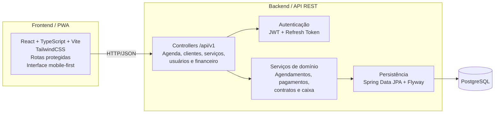

  <h1>Mar de Beleza — Case técnico e de produto</h1>

  

    Sistema full-stack de gestão para salão de beleza, desenvolvido para centralizar agenda,
    clientes, profissionais, serviços e financeiro em uma operação real.
  

  

    <strong>Case desenvolvido por Rafael Maia</strong> 
    Consultor Tecnológico & Desenvolvedor Full-Stack
  

---

## Sobre o case

O **Mar de Beleza** é um sistema de gestão para salão de beleza que nasceu de uma necessidade operacional real.

Antes do sistema, parte da rotina dependia de agenda física, conversas no WhatsApp, controles manuais e conferências espalhadas. Agendamentos, clientes, profissionais, serviços e pagamentos precisavam ser organizados de forma mais clara, centralizada e confiável.

A solução foi desenvolvida como uma aplicação full-stack mobile-first, com backend em **Java/Spring Boot** e frontend em **React/TypeScript**, reunindo os principais fluxos da operação em um único sistema.

O repositório principal do projeto é privado por envolver uma aplicação real em produção. Este repositório serve como apresentação pública do case, com contexto, funcionalidades, arquitetura e link para a landing page.

🔗 **Case público:** [Mar de Beleza — Case técnico e de produto](https://mar-de-beleza-case.vercel.app/)

---

## Minha atuação

Atuei em todas as etapas do projeto, conectando entendimento da operação, decisões de produto e desenvolvimento full-stack.

Minha atuação envolveu:

- diagnóstico da rotina manual do salão;
- identificação dos principais gargalos operacionais;
- definição do escopo inicial do produto;
- modelagem das regras de negócio;
- desenvolvimento do backend e frontend;
- implantação da solução em produção;
- evolução contínua com base no uso real e feedback das usuárias.

---

## Funcionalidades principais

- **Agenda do dia**
  - visualização de atendimentos por data;
  - acompanhamento de status;
  - filtros por profissional, cliente, data e situação;
  - ações rápidas para criar, editar, cancelar e concluir agendamentos.

- **Clientes**
  - cadastro e consulta de clientes;
  - organização de dados de contato;
  - reutilização das informações nos fluxos de agendamento e pagamento.

- **Profissionais e usuários**
  - cadastro de profissionais;
  - controle de usuários;
  - separação entre perfis administrativos e operacionais.

- **Serviços**
  - catálogo de serviços;
  - definição de duração e preço;
  - integração com os fluxos de agendamento.

- **Pagamentos e financeiro**
  - registro de pagamentos;
  - acompanhamento de valores por período;
  - controle de comissões, aluguéis, valores do salão e entradas financeiras.

- **PWA mobile-first**
  - interface pensada para uso em celular;
  - navegação simples para a rotina do salão;
  - experiência próxima de aplicativo instalável.

---

## Arquitetura do sistema

```mermaid
flowchart LR
  subgraph Frontend["Frontend / PWA"]
    UI["React + TypeScript + Vite<br/>TailwindCSS<br/>Rotas protegidas<br/>Interface mobile-first"]
  end

  subgraph Backend["Backend / API REST"]
    Auth["Autenticação<br/>JWT + Refresh Token"]
    Controllers["Controllers /api/v1<br/>Agenda, clientes, serviços,<br/>usuários e financeiro"]
    Domain["Serviços de domínio<br/>Agendamentos, pagamentos,<br/>contratos e caixa"]
    Persistence["Persistência<br/>Spring Data JPA + Flyway"]
  end

  DB[("PostgreSQL")]

  UI -->|"HTTP/JSON"| Controllers
  Controllers --> Auth
  Controllers --> Domain
  Domain --> Persistence
  Persistence --> DB
```

A arquitetura separa frontend, backend e banco de dados, mantendo as regras de negócio concentradas na API. Essa divisão facilita a evolução da interface, a manutenção dos fluxos operacionais e a implantação em ambientes separados.

O **frontend** foi desenvolvido com React, TypeScript, Vite e TailwindCSS, consumindo a API REST e priorizando uma experiência mobile-first.

O **backend** foi desenvolvido com Java 21, Spring Boot 3, Spring Security, JWT, Spring Data JPA, PostgreSQL e Flyway, concentrando autenticação, permissões, persistência e os principais fluxos da operação.

---

## Stack técnica

**Backend:** Java 21 · Spring Boot 3 · Spring Security · JWT · Spring Data JPA · Flyway  
**Frontend:** React · TypeScript · Vite · TailwindCSS · PWA  
**Banco de Dados:** PostgreSQL  
**Testes:** JUnit 5 · Mockito · H2  
**Infraestrutura:** Docker · Railway · Vercel  
**Práticas:** APIs REST · modelagem de domínio · separação de responsabilidades · refatoração

---

## Impacto

A centralização dos fluxos reduziu a dependência de controles manuais e tornou a operação mais organizada, previsível e fácil de acompanhar.

Entre os principais ganhos observados:

- redução estimada de **35% a 40% no tempo operacional diário**;
- menos retrabalho na organização da agenda;
- menos erros de agendamento;
- mais clareza sobre pagamentos e registros financeiros;
- melhor acompanhamento da rotina por parte da equipe.

---

## Observação

Este repositório não contém o código-fonte principal do sistema.

O objetivo aqui é apresentar publicamente o contexto, a solução, a arquitetura e os resultados do projeto, preservando a aplicação real em produção.

Para visualizar o case completo, acesse:

🔗 **[Mar de Beleza — Case técnico e de produto](https://mar-de-beleza-case.vercel.app/)**

---

  
Desenvolvido por Rafael Maia

  <a href="https://www.linkedin.com/in/rafaelmaiia/" target="_blank">
    LinkedIn
  </a>
  ·
  <a href="mailto:rafaelmaia.developer@gmail.com">
    E-mail
  </a>

